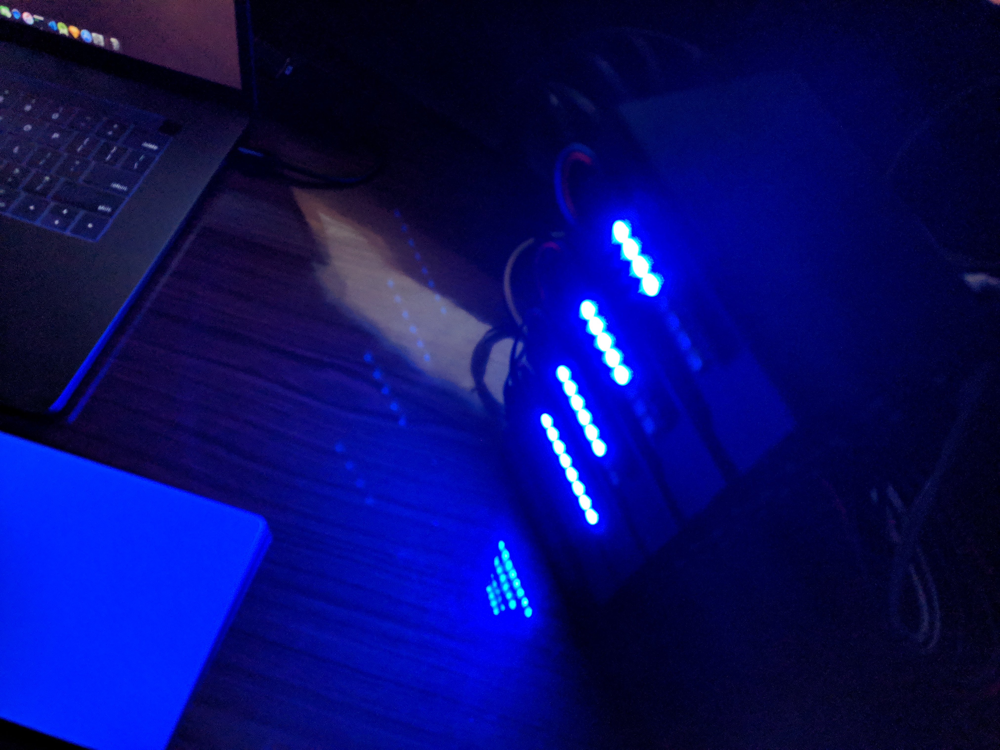

# Pod Visualization to your Raspberry Pi Kubernetes cluster

## To run the prebuilt images on your cluster, just do a
> ### Note: Make sure you've connected the NeoPixel Stick to the GPIO Pin 8 of your Raspberry Pi when using the prebuilt images
```
kubectl apply -f led-pod-daemon.yaml
```
## And Voila


## Acknowledgements
This project draws inspiration from the project [Apprenda](https://github.com/apprenda/blinkt-k8s-controller)